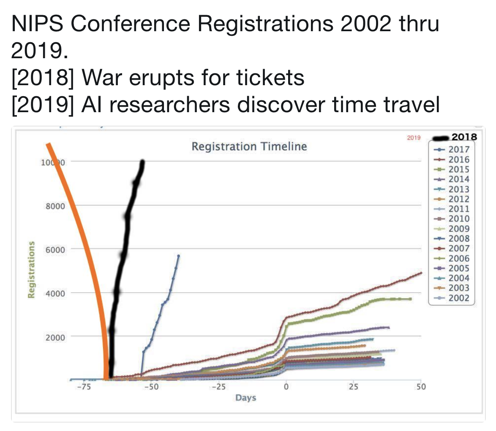

<style>
body {
  text-align: justify;
}
</style>

# MENU

1. [Introduction](#introduction)
2. [About the Instructor](#about-the-instructor)
3. [Prerequisites](#prerequisites)
4. [Evaluation](#evaluation)
5. [Syllabus](#syllabus)
    - [Resources](#resources)
    - [Lectures](#lectures)
6. [Policies](#policies)
7. [Contact](#contact)

---

# INTRODUCTION

This is an introductory course on Artificial Intelligence, Neural Networks and Deep Learning designed for Keio University. All course materials and updates to the syllabus will be published through this git repository. The material introduced in this course forms a pre-requisite for a follow up course on topics in advanced Artificial Intelligence, which I will teach in the following term. However, this course can be also taken in isolation as an introduction to the fundamental concepts on which modern AI systems are based.

Recent years have brought a revolution in the field of Artificial Intelligence on an unprecedented scale. Advances in hardware, availability of large data sets, as well as innovation in architectural and algorithmic design, enabled successful application of Machine Learning models based on multi-layered Artificial Neural Networks to a variety of problems of practical interest. The sub-field of AI focusing on deep (multi-layered) neural architectures and the associated algorithms is collectively known as Deep Learning. The success of Deep Learning has been so great in recent years, that all of modern AI is basically the study of deep neural architectures. Deep Learning models hold state-of-the-art results on virtually all AI tasks, and new discoveries are made daily.

In many real world Machine Learning tasks, in particular those with perceptual input, such as Vision and Speech, the mapping from raw data to the output is often a complicated function with many factors of variation. Prior to 2010, to achieve decent performance on such tasks, significant effort had to be put to engineer hand-crafted features. Deep Learning algorithms aim to learn feature hierarchies with features at higher levels in the hierarchy formed by the composition of lower level features. This automatic learning of features has been demonstrated to uncover underlying structure in the data (c.f. the manifold hypothesis in data science). The first success came in the fields of vision and speech processing. Recently, NLP, and reinforcement learning became the new frontiers for deep neural networks.

This course aims to introduce the students to the field of Artificial Intelligence, focusing on Artificial Neural Networks and Deep Learning. Since this is a rapidly developing field, we will focus on most important trends and core ideas, as it is impossible to cover all recent developments in a single course. We will follow historical developments in AI with a focus on neural information processing systems, and see how the current ideas emerged out of decades of research in the field. We will then discuss current neural architectures and algorithms, as well as introduce modern trends. After completing this course, students should have appreciation and understanding of neural AI systems, and anticipate future developments in research and applications of AI, and Deep Learning in particular. In addition to theory, there will be emphasis on programming skills in Python. Students will implement deep neural AI systems, and train them on a variety of data sets.

The sequel to this course - Topics in Advanced Artificial Intelligence (aka Artificial Intelligence B) - will discuss a selection of more complex neural information processing systems used in state-of-the-art results as well as emerging and more advanced topics. The other course also develops programming skills using modern tensor computation frameworks, as well as the ability to read academic papers in the field. However, it is necessary to master the material in this course before progressing to those more advanced topics.

Deep Learning hype in one picture (source: Soumith Chintala from Facebook AI Research):

<span style="display:block;text-align:center">{:height="60%" width="60%"}</span>

---

# ABOUT THE INSTRUCTOR

<span style="display:block;text-align:center">{:height="30%" width="30%"}</span>

I'm an American research scientist working on Artificial Intelligence. My main interests are Deep Neural Networks, Computational Linguistics / NLP, and Reinforcement Learning. I'm also interested in Economics, Law, and Entrepreneurship. I've been a founding member of the Chicago Innovation Exchange (center for new technology startups in Chicago, sponsored by the Booth School of Business at the University of Chicago), and I've been applying AI techniques to algorithmic trading (winning data science competitions in the US focusing on applying machine learning to economics and finance). My hobbies are traveling and making electronic music (I've lived in several countries and visited more than twenty, spanning multiple continents). I particularly enjoy visiting Tokyo, and it has been my most frequent destination throughout my life.

I did my BA at Columbia University (New York, USA), MPhil at University of Cambridge (Cambridge, U.K.), and PhD at the University of Chicago (Illinois, USA).

---

# PREREQUISITES

There are no formal pre-requisites for this course. However, I expect that students have certain level of mathematical maturity. Optimally, students should have taken courses in linear algebra (covering abstract vector spaces), multivariable calculus and optimization (e.g. analysis of functions over the real field), basic statistics (probability theory, regression, gaussians etc.), and be familiar with a modern programming language. Those pre-requisites would be helpful, as AI algorithms tend to have heavy mathematical basis. However, I aim to make this course self-contained, so there will be a brief overview of those topics (with attention on the concepts most relevant to AI) during the first two weeks of the course. Therefore, even students without formal background in mathematics and statistics can take the course. For students without any experience writing computer programs, I suggest you review basic data structures and algorithms, and attain elementary Python programming skills (e.g. this course [https://www.coursera.org/learn/python](https://www.coursera.org/learn/python)).

Students should also familiarize themselves with git version control system ([Git](https://en.wikipedia.org/wiki/Git)). The course materials will be hosted on GitHub ([GitHub](https://github.com/)) in a course repository. Students will also submit homework assignments via git. There will be a brief overview of git and GitHub during the first week of lectures.

---

# EVALUATION

Final grade for this course will be based on the following factors:

  * participation in class discussions: 10%
  * first project: 25%
  * second project: 25%
  * exam: 25%
  * quiz: 15%

Grades will be communicated via [GradeScope](https://gradescope.com/).

---

# SYLLABUS

## Resources

Readings and data will be posted in the course GitHub repository under the the docs directory. In order to obtain the latest version of the repository first clone it on your system:

```
$ git clone https://github.com/stephenfitz/keio2018aia.git
```

then periodically pull the changes:

```
$ cd keio2018aia
$ git pull
```

Everyone should also join the [Piazza](https://piazza.com/) group for the course. The Piazza forum is a place for you to discuss lectures, assignments, projects, exams etc. with other students. You should check it often and try to answer your classmates' questions. This kind of collaborative forum is used at most US universities to improve student communication.

Please use the following invitation link to the Piazza course page: 
[http://piazza.com/keio.ac.jp/fall2018/keio2018aia](piazza.com/keio.ac.jp/fall2018/keio2018aia).

For live discussion, as well as announcements by the professor, there is a [Slack](https://slack.com/) channel for the course.

Please use the following invitation link to join the Slack channel: 
[https://join.slack.com/t/keio2018aia/shared_invite/enQtNDQ0ODU2NTU2NDU0LThkN2ZjYzRhODNiZjdhYWZlMTlmOTE3MDg0OWJhMWI5NjAxMGEzYjVlYzk4YjQ5ODBlNDk1YjQ5OGUyZWU5Y2E](https://join.slack.com/t/keio2018aia/shared_invite/enQtNDQ0ODU2NTU2NDU0LThkN2ZjYzRhODNiZjdhYWZlMTlmOTE3MDg0OWJhMWI5NjAxMGEzYjVlYzk4YjQ5ODBlNDk1YjQ5OGUyZWU5Y2E).

Lecture notes should be sufficient, hence attending every lecture is highly recommended. In addition to the lectures, the following books might be useful for more ambitious students (although they are not officially required for the course):

* Deep Learning (By Ian Goodfellow and Yoshua Bengio and Aaron Courville; MIT Press, 2016)
* Machine Learning - a probabilistic perspective (Kevin P. Murphy; MIT Press)

Deep learning is a rapidly evolving field and so we will freely move from using recent research papers to materials from older books etc. 

## Lectures

Lectures are given once per week (15 in total), each lasting 1.5h.

Reading materials should be reviewed before the class meeting - i.e. the assigned readings for any lecture should be completed before that lecture is given. Some of the reading materials might be above the level of many students. However, they are given for students to skim over, and get a general idea. Concepts from the assigned readings will be explained by the instructor during lectures. The exam will only ask questions about the material explicitly discussed in class by the instructor.

Below is a rough estimate of the topics for each lecture. However, the details might shift as the course progresses.

lecture | topics
---- | ------
1 | introduction
2 | history of AI and DL
3 | introduction to artificial neural networks; learning theory; feed-forward architectures
4 | programming environment; tensor computation frameworks
5 | vector space embeddings of words, distributed representations of data
6 | recurrent neural networks; attention mechanisms; gated architectures
7 | sequence data modeling with long short-term memory recurrent neural networks
8 | neural machine translation; encoder-decoder models
9 | convolutional architectures; convnets for image classification and other tasks
10 | convolutional sequence models; hybrid cnn-rnn models; joint embedding of various forms of data
11 | language grounding in the context of image captioning; second project announcement
12 | midterm exam
13 | char-rnn; open-vocabulary hierarchical-rnn in language modeling
14 | language acquisition in simulated environments; instruction following
15 | quiz; review; future of AI and impact on society

---

# POLICIES

I expect students to attend all lectures, as part of the grade is based on class discussion, and I will often mention things in class which might be missing from written materials. Additionally, each student should schedule office hour visitation with the instructor at least once during the course.

Class projects will be done in teams of 2-3 people. This has a pedagogical goal of teaching students to work in groups, and use git collaboratively (as it is one of its main purposes), which is how virtually all modern software is developed. The ability to solve problems, and work together in groups is a critical skill that will prove useful to students throughout their academic and professional careers.

---

# CONTACT

You can contact the instructor at stephenf@keio.jp and on the Slack channel.
